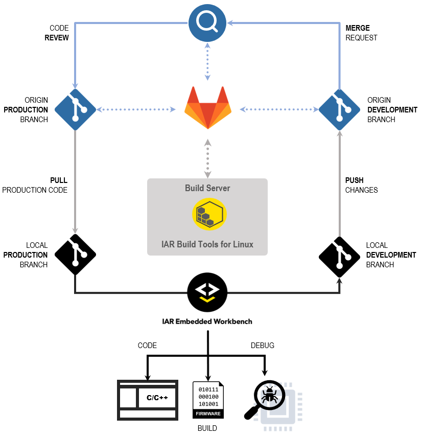
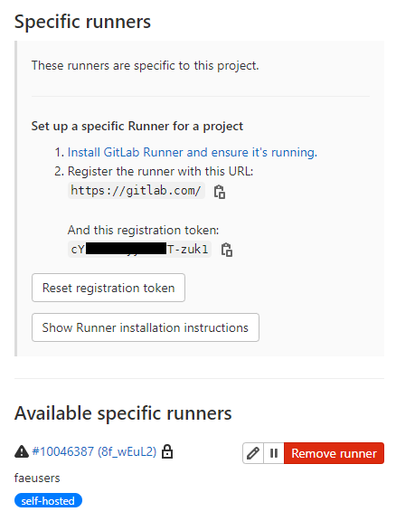
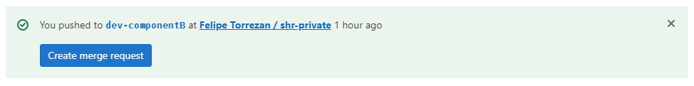
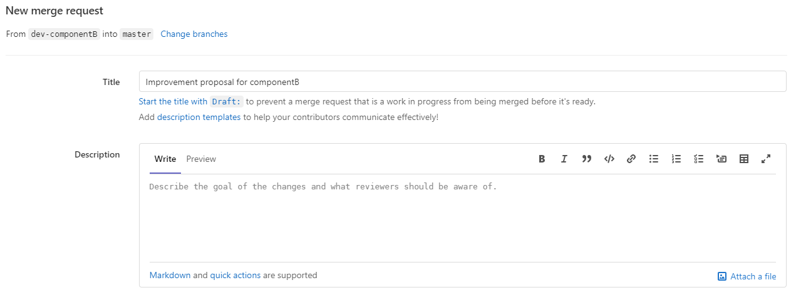
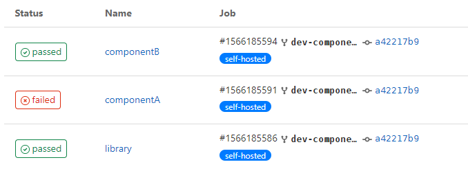

# Tutorial<br/>IAR Build Tools for Linux in a GitLab CI 

Each of the __IAR Build Tools for Linux__ packages requires its specific license. Please feel free to [__contact us__](https://iar.com/about/contact) if you would like to learn how to get access to them.

If you want to be notified in your GitHub inbox about updates to this tutorial, you can start __watching__ this repository. You can customize which types of notification you want to get. Read more about [notifications](https://docs.github.com/en/github/managing-subscriptions-and-notifications-on-github/setting-up-notifications/about-notifications) and how to [customize](https://docs.github.com/en/github/managing-subscriptions-and-notifications-on-github/setting-up-notifications/about-notifications#customizing-notifications-and-subscriptions) them.

If you end up with a question specifically related to [this tutorial](https://github.com/iarsystems/bx-gitlab-ci), you might be interested in verifying if it was already answered from [earlier questions][repo-old-issue-url]. Or, [ask a new question][repo-new-issue-url] if you could not find any answer for your question.


## Introduction
This tutorial provides a simple example with general guidelines on how to set up a CI (Continuous Integration) workflow with [IAR Build Tools for Linux][iar-bx-url] alongside [GitLab](https://gitlab.com).

### GitLab
At GitLab, a private project repository, called [__origin__](https://git-scm.com/book/en/v2/Git-Basics-Working-with-Remotes) in the Git jargon, starts with a __master__ branch containing the __production__ code. 

The repository also contains a "recipe" for the workflow under `.gitlab-ci.yml`. The recipe is written in the [__YAML__](https://en.wikipedia.org/wiki/YAML) format and can be customized. We provided one simple example as base, although the [official documentation][gl-doc-yaml-url] can help with further customizations.

The repository will be configured to use one GitLab's [self-hosted runner][gl-shr-url].

>:warning: GitLab requires an [account][gl-join-url].


### Build server
The __build server__ will be where the [__IAR Build Tools for Linux__][iar-bx-url] are installed.

It will serve as a [self-hosted runner][gl-shr-url] from where the [pipeline][gl-pipeline-url] will take place.  This runner will be configured to automatically connect to the __origin__. When triggered, the runner will execute a job that, after cloning the repository and will use the __IAR Build Tools for Linux__ to build these projects.


### Development workstation
On his workstation, a _developer_ clones the repository to start working on a new feature for some project. For that, he creates a __feature branch__.

The _developer_ then launches the [IAR Embedded Workbench][iar-ew-url], from where he can __code__, __build__ and __debug__ the project.

When the _developer_ is done with that, he can, through his own GitLab account, __push__ the branch to the __origin__ using a __git client__.

>:warning: Popular choices for Windows that provide a __git client__ are [Git for Windows][g4w-url] or even [Ubuntu WSL][wsl-url]. In this tutorial, we are going to use the git from the command-line.

### The typical CI workflow
The objective is to have automated builds for keeping track of which changes break the build before they are introduced into the __master__ branch. This practice can help raise the project's overall quality metrics.

When a _developer_ pushes changes to the __origin__, the GitLab CI/CD pipeline comes into play and triggers an action to notify the runner in the __build server__ about the new __push__.

On the build server, the runner will then execute the "recipe" to build the project with the __IAR Build Tools__. 

If the new feature passes, the _code reviewer_ can decide if these changes are ready to be merged to the __master__ branch.

If the new feature fails, the follow-up can be performed within GitLab's own facilities for code revision.

This CI repeats as many times as required.



## Conventions
As this tutorial is intended to be flexible with respect to the tools and packages that can be used, it becomes important to establish some conventions for when referring to certain entities.

### Packages
| __Placeholder__ | __Meaning__                                                                               |
| :-------------- | :---------------------------------------------------------------------------------------- |
| `<arch>`        | __Architecture__<br/>Valid: `arm`, `riscv`, `rh850`, `rl78`, `rx`                         |
| `<package>`     | __Product package__<br/>Valid: `arm`, `armfs`, `riscv`, `rh850`, `rh850fs`, `rl78`, `rx`  |
| `<version>`     | __Package version__<br/>Valid: `major`.`minor`.`patch` `[.build]`                         |

Here you will find some examples for different packages and their versions:
| __Package/Version__       | __Replace with__                                                                                                                               |
| :------------------------ | :--------------------------------------------------------------------------------------------------------------------------------------------- |
| BXARM 9.10.1              | IAR Build Tools for Arm version 9.10.1<br/>`<arch>`=`arm`<br/>`<package>`=`arm`<br/>`<version>`=`9.10.1`                                       |
| BXARMFS 8.50.10.35167     | IAR Build Tools for Arm, [Functional Safety Edition](https://www.iar.com/products/requirements/functional-safety/), version 8.50.10<br/>`<arch>`=`arm`<br/>`<package>`=`armfs`<br/>`<version>`=`8.50.10.35167` |
| BXRISCV 1.40.1            | IAR Build Tools for RISC-V version 1.40.1<br/>`<arch>`=`riscv`<br/>`<package>`=`riscv`<br/>`<version>`=`1.40.1`                                |

### Others
| __Placeholder__ | __Meaning__                                                                               |
| :-------------- | :---------------------------------------------------------------------------------------- |
| `<username>`    | Refer to the user's GitLab's account or the user's account in the local machine, according to the context.                    |

## Preparing the repository 
Under GitLab's account, we are going to import the [bx-workspaces-ci][bx-workspaces-url] repository. This is a public repository containing a collection of workspaces which were created using the IAR Embedded Workbench. They can be imported to become a private repository and then used for experimentation with the IAR Build Tools for Linux.

### Importing an example repository
Navigate to
```
https://gitlab.com/projects/new#import_project
```

Fill __Git repository URL__ with
```
https://github.com/IARSystems/bx-workspaces-ci
```

On __Project name__, fill with the new name. For this example, let's use `shr-private`:
```
shr-private
```

Make sure that __Visibility Level__ is set to `Private`.

>:warning: GitLab adverts against using self-hosted runners with public repositories due [performance and security reasons][gl-private-url]. 

Finally, click __Create project__.

Once the importing process is complete, a message banner will show up:
>```
>"The project was successfully imported."
>```
    
Then you will automatically be taken to the repository's page.

### Adding a workflow
On your `shr-private` repository, use the GitLab interface to add the following new file [`.gitlab-ci.yml`](https://docs.gitlab.com/ee/ci/quick_start/#create-a-gitlab-ciyml-file). This workflow contains 3 jobs to be run on the runner tagged as "self-hosted". This workflow first builds `library` and then, in the sequence, it builds `componentA` and `componentB`:
```yaml
variables: 
  BUILD_TYPE: Debug
  IARBUILD_PATH: '/opt/iarsystems/bx<package>-<version>/common/bin'
  IARBUILD_OPTS: '-log all -parallel 2'
  
library:
  tags:
    - self-hosted
  stage: .pre 
  only:
    - branches
  needs: []
  script:
    - echo "Building library..."
    - $IARBUILD_PATH/iarbuild ./<arch>/library.ewp    -build $BUILD_TYPE $IARBUILD_OPTS
  artifacts:
    paths:
      - ./<arch>/Debug/Exe/library.a
    expire_in: 1 week

componentA:
  tags:
    - self-hosted
  stage: build
  only:
    - branches
  needs: ["library"]
  script:
    - echo "Building compomentA..."
    - $IARBUILD_PATH/iarbuild ./<arch>/componentA.ewp -build $BUILD_TYPE $IARBUILD_OPTS

componentB:
  tags:
    - self-hosted
  stage: build
  only:
    - branches
  needs: ["library"]
  script:
    - echo "Building componentB..."
    - $IARBUILD_PATH/iarbuild ./<arch>/componentB.ewp -build $BUILD_TYPE $IARBUILD_OPTS
  
```
>:warning: Change `<arch>`, `<package>` and `<version>` to match with the __IAR Build Tools for Linux__ you are using. Please refer to [Conventions](#conventions) for details.

### Adding a runner to the repository
The GitLab repository must be set to use a __runner__.

Under the `<username>`'s account, go to __Settings__ → __CI/CD__.
```
https://gitlab.com/<username>/shr-private/-/settings/ci_cd
```

Then unfold __Runners__.

Take note of the __registration token__ displayed in this section.

Then click on the `Show Runner installation instructions` button.

A new modal window titled __Install a runner__ will popup.

For __Environment__, select __`Linux`__.

For __Architecture__, select __`amd64`__.

Keep this page open.


## Setup the Build Server
Go to the __build server__ and perform the following setup.

### Setup the runner
Follow the instructions that appear on the box about how to __Download and install binary__ to configure the runner.

>:warning: By downloading and configuring the GitLab Runner, you agree to the [GitLab Terms of Service](https://about.gitlab.com/handbook/legal/policies/website-terms-of-use), as applicable.

Next, use the __Command to register runner__. 

Use the __registration token__ from the previous page, replacing `$REGISTRATION_TOKEN` by the appropriate value.

When asked about the __tags for the runner__, enter with __self-hosted__.

When asked about the __Executor__, select __shell__.

After the "Runner registered successfully." message, the __Runners__ section in the __CI/CD__ page should show it in the __Available specific runners__.



### Install the IAR Build Tools for Linux
Install the IAR Build Tools for Linux.

>:warning: Follow the instructions and recommendations of the User Guide that comes with the product.

Additionally, it is possible to add the __IAR Build Tools__ directories containing the executables to the search `PATH`, so they can be executed from anywhere without entering with their full path. This is not a requirement for this tutorial, but it might be convenient for some users.
    
For example, paste the snippet below to the user's `$HOME/.profile` (or else the `$HOME/.bashrc`) file:
```sh
if [ -d "/opt/iarsystems/bx<package>-<version>" ]; then
  PATH="/opt/iarsystems/bx<package>-<version>/<arch>/bin:/opt/iarsystems/bx<package>-<version>/common/bin:$PATH"
fi
```

>:warning: Change `<arch>`, `<package>` and `<version>` to match with the __IAR Build Tools for Linux__ you are using. Please refer to [Conventions](#conventions) for details.

After the file is saved, it is possible to source the file you modified so the changes take effect immediately. For example, 
```
source ~/.profile
```


## Developing a Project
Now that the server-side of the setup is done, let's start to try it from a __developer__'s perspective, from within the [Development workstation](#development-workstation).


### Cloning the repository    
Launch the terminal which provides your __git client__ and clone the `shr-private` repository you imported into your `<username>` account:

```
git clone https://gitlab.com/<username>/shr-private.git /mnt/c/shr-private && cd /mnt/c/shr-private
```
>:warning: For this tutorial we are assuming that the clone location will be the `C:\shr-private` folder.

    
### Switching to a feature branch        
Now let's consider starting to work on a new feature for the `ComponentB`. Checkout a new branch named "dev-componentB", derived from the master branch:
```
git checkout -b dev-componentB master
```

In the __IAR Embedded Workbench IDE__ choose `File` → `Open Workspace...` and navigate to `C:\shr-project\<arch>`. You will find a `workspace.eww` file. Go ahead and __open__ it.

This example workspace comes with 3 projects:
* library
* componentA
* componentB

Right-click on the __`library`__ project and choose `Make` (or <kbd>F7</kbd>). The `library` project should be built with no errors.

Now right-click on the `componentB` project and __Set as Active__.

Unfold the __`componentB`__ project tree and double click on its [main.c](../workspace/portable/componentB/main.c) file so it will open in the __Code Editor__.

Right-click on __`componentB`__ and choose `Make` (or <kbd>F7</kbd>). The `componentB` project should be built with no errors.


### Changing the code for the `componentB` project 
The __developer__ starts to work on the `dev-componentB` branch and, for illustrative purposes, the `DATATYPE` used in `componentB` had to change from `uint16_t` to __`float`__, for example, to hold values greater than `0xFFFF`.

On the [main.c](https://github.com/iarsystems/bx-workspaces-ci/workspace/portable/componentB/main.c#L12) file, right-click on the line with the __[`#include "library.h"`](https://github.com/iarsystems/bx-workspaces-ci/workspace/portable/componentB/main.c#L12)__ and choose __Open "library.h"__.

In the [library.h](../workspace/portable/library/library.h) file, find the line __[`#define DATATYPE uint16_t`](../workspace/portable/library/library.h#L19)__ and replace it with
```c
#define DATATYPE float
```
  
In the [main.c](../workspace/portable/componentB/main.c) file, update the constant `z` to `100000`.
```c
  const DATATYPE z = 100000;
```

On the same file, update the `debug_log()` function string format to handle the __float__ type. Change the formatted string from `%d` to `%f` as below:
```c
  debug_log("Sum = %f\r\n", sum);
```
and
```c
  debug_log("Mul = %f\r\n", mul);
```
  
Rebuild the `library` project using right-click on `library` and choose `Make` (or <kbd>F7</kbd>). It should build with no errors.

Rebuild the `componentB` project using right-click on `componentB` and choose `Make` (or <kbd>F7</kbd>). It should build with no errors.

>:warning: If you want, you can debug the project using `Project` → `Download & Debug` (or <kbd>CTRL</kbd>+<kbd>D</kbd>). The details of debugging a project are not going to be covered in this tutorial. For further details on debugging a project, refer to the `Help` → `C-SPY Debugging Guide` document that is shipped with the product.


### Commit the changes
Go back to the terminal where you used your __git client__. 

Commit to the changes to the tracked files in the cloned `shr-project` repository:
```
git commit --all --message "Improvement proposal for componentB"
```

The expected output is similar to this, but with a different commit hash:
>```
>[dev-componentB 5b03ed8] Improvement proposal for componentB
>  2 files changed, 5 insertions(+), 5 deletions(-)
>```

Finally publish these changes with `git push`, so the code changes go back to the __origin__ repository:
```
git push --set-upstream origin dev-componentB
```

## Creating a Merge Request
Then it is time for the __developer__ to go back his __GitLab.com__.

Go to `https://gitlab.com/<username>/shr-private` and notice that there is a new banner on the top


Click `Create merge request`.

Here, GitLab will give you the opportunity to describe the goal of the changes and what reviewers should be aware of.



Once ready, click `Create merge request`.

>:warning: Follow the link to learn more [about merge requests](https://docs.gitlab.com/ee/user/project/merge_requests/creating_merge_requests.html).
    
    
## Reviewing the Merge Request
The [bx-workspaces-ci][bx-workspaces-url] repository comes pre-loaded with a [pipeline][gl-pipeline-url] configured in the [`.gitlab-ci.yml`](#adding-a-workflow) file that will trigger the notification the runner in the __build server__ needs to build all the 3 projects automatically when a new feature branch goes through a merge request.
    
Now a project's code reviewer can start [reviewing the merge request](https://docs.gitlab.com/ee/user/project/merge_requests/reviews/) containing the proposed changes in the new feature.

With the right workflow for a project, if some developer created something new that breaks the existing build, it will fail the automated verification. So a _code reviewer_ can know immediately about the breakage and its details.



In this case, the author's proposed change to the shared `library` worked nicely for `componentB` but it didn't for `componentA`. 
    
The code reviewer can contact the author using the `merge request` page, so it is easy to keep track of any amends to the proposed code, until it is approved or rejected.


## Summary

In short, in this tutorial we went through one of the many ways that the [IAR Build Tools for Linux][iar-bx-url] can be used in CI scenarios.

Over time, a practice like this can help guaranteeing convergence to improved quality of the production grade code base. It also helps avoiding that new features break other parts of a project. Ultimately it builds a development log of the project which, when properly used, can become a solid asset for consistent deliveries as the project evolves.    
    
The IAR Build Tools for Linux along with the GitLab CI provides a great and scalable way to manage automation tasks for building, and analyzing embedded software projects. Hence it might be suitable for many use cases.
   
For more tutorials like this, stay tuned on our [GitHub page][gh-iar-url].

<!-- links -->
[iar-bx-url]: https://www.iar.com/bx
[iar-ew-url]: https://www.iar.com/products/architectures
[iar-lms2-url]: https://links.iar.com/lms2-server
[iar-bkpt-url]: https://www.iar.com/about/news-and-events/the-weekly-breakpoint-blog

[gh-iar-url]: https://github.com/IARSystems
    
[g4w-url]: https://git-scm.com/download/win
[wsl-url]: https://www.microsoft.com/en-us/p/ubuntu-2004-lts/9n6svws3rx71

[gl-doc-yaml-url]: https://docs.gitlab.com/ee/ci/yaml/gitlab_ci_yaml.html
[gl-shr-url]: https://docs.gitlab.com/runner
[gl-join-url]: https://gitlab.com/users/sign_in
[gl-pipeline-url]: https://docs.gitlab.com/ee/ci/pipelines
[gl-private-url]: https://docs.gitlab.com/runner

[bx-workspaces-url]: https://github.com/IARSystems/bx-workspaces-ci
[repo-wiki-url]: https://github.com/IARSystems/bx-gitlab-ci
[repo-new-issue-url]: https://github.com/IARSystems/bx-gitlab-ci/issues/new
[repo-old-issue-url]: https://github.com/IARSystems/bx-gitlab-ci/issues?q=is%3Aissue+is%3Aopen%7Cclosed
